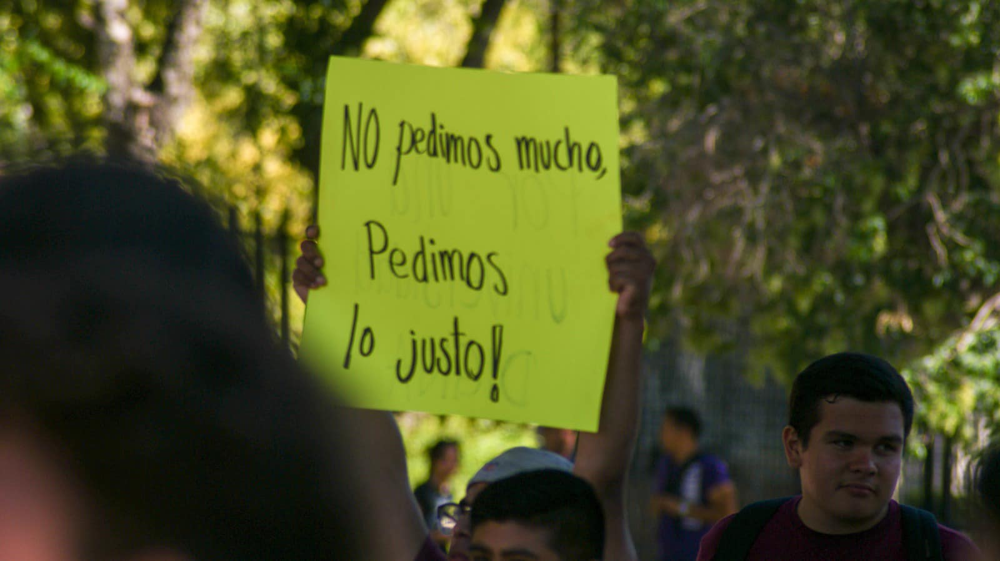

<!DOCTYPE html>
<html>
<head>
  <link href="https://cdn.jsdelivr.net/npm/bootstrap@5.1.0/dist/css/bootstrap.min.css" rel="stylesheet">
  
  <link rel="stylesheet" href="https://cdnjs.cloudflare.com/ajax/libs/font-awesome/4.7.0/css/font-awesome.min.css">
<section class="section">
  

      <h3 class="page__heading" style="font-family: Lastica, Arial, sans-serif; background-color: #000000; padding: 20px; text-align: center; margin-top: 100x; color: #ffffff; font-size: 50px;">
          el tec no es cantina</h3>
  

</section>
</head>
<body style="height: 100%; margin: 0;">

  

    
<audio controls autoplay>
      <source src="sia unstoppabble.mp3" type="audio/mpeg">
    Your browser does not support the audio element.
    </audio>

    <ul style="list-style-type: none; padding: 0;">
      <li style="display: inline-block; margin-right: 10px;">
        <a href="menu_ejercicios.html" class="button">Ejercicios de mecanismos</a>
      </li>
      <li style="display: inline-block; margin-right: 10px;">
        <a href="menu_formulas.html" class="button">Formulas</a>
      </li>
      <li style="display: inline-block; margin-right: 10px;">
        <a href="datos.html" class="button">Acerca de</a>
      </li>
    </ul>
  

  <h1 style="color: rgb(255, 255, 255); text-align: center; font-family:Century Gothic, sans-serif; padding: 20px;">¿Qué está pasando en el ITS y por qué nos afecta a todos los estudiantes?</h1>
  

    

  
Instituto Tecnologico de Saltillo

 

<h1 style="color: rgb(255, 255, 255); text-align: center; font-family: Arial, sans-serif; padding: 20px; font-size: 40px;">Bienvenido/a</h1>

  

    El jueves 14 de septiembre, para conmemorar el aniversario de
    la Independencia de México, el gobierno de Coahuila organizó un evento masivo en el que se presentó el Grupo Frontera.
      
   
  

  

    <button type="button" data-bs-target="#carouselExampleDark" data-bs-slide-to="0" class="active" aria-current="true" aria-label="Slide 1"></button>
    <button type="button" data-bs-target="#carouselExampleDark" data-bs-slide-to="1" aria-label="Slide 2"></button>
    <button type="button" data-bs-target="#carouselExampleDark" data-bs-slide-to="2" aria-label="Slide 3"></button>
    <button type="button" data-bs-target="#carouselExampleDark" data-bs-slide-to="3" aria-label="Slide 4"></button>
    <button type="button" data-bs-target="#carouselExampleDark" data-bs-slide-to="4" aria-label="Slide 5"></button>
    <button type="button" data-bs-target="#carouselExampleDark" data-bs-slide-to="5" aria-label="Slide 6"></button>
    <button type="button" data-bs-target="#carouselExampleDark" data-bs-slide-to="6" aria-label="Slide 7"></button>
    <button type="button" data-bs-target="#carouselExampleDark" data-bs-slide-to="7" aria-label="Slide 8"></button>
    <button type="button" data-bs-target="#carouselExampleDark" data-bs-slide-to="8" aria-label="Slide 9"></button>
    <button type="button" data-bs-target="#carouselExampleDark" data-bs-slide-to="9" aria-label="Slide 10"></button>
    <button type="button" data-bs-target="#carouselExampleDark" data-bs-slide-to="10" aria-label="Slide 11"></button>
    <button type="button" data-bs-target="#carouselExampleDark" data-bs-slide-to="11" aria-label="Slide 12"></button>
    <button type="button" data-bs-target="#carouselExampleDark" data-bs-slide-to="12" aria-label="Slide 13"></button>
    <button type="button" data-bs-target="#carouselExampleDark" data-bs-slide-to="13" aria-label="Slide 14"></button>
  

  

    

      
      

        

          El escenario se instaló a las afueras del Ateneo Fuente, sobre V. Carranza y <strong>se utilizó la explanada del Tecnológico como área 
          "VIP"</strong> en la que <strong>funcionarios</strong> del gabinete estatal, municipal, además de colaboradores de medios de comunicación locales disfrutaron 
          del concierto, en sillas y mesas donde también sirvieron bebidas alcohólicas y por ende, <strong> hicieron uso de las instalaciones del ITS, 
          mismas que se entregaron a los alumnos en malas condiciones luego del evento</strong>.

      

    

    

      
      

        

          El 18 de Septiembre los estudiantes organizaron un plantón para exigir la destitución de la directora María Gloria Hinojosa Ruiz, quien facilitó las instalaciones académicas 
          a los funcionarios públicos durante el concierto y quien tomó la decisión de suspender las clases previo al evento.

      

    

    

      
      

        

           También piden que el presidente de la Sociedad de Alumnos, Jesús Siller, se retire de su cargo pues no ha dado razón a los quejosos que son mayoría..

      

    
      
    

      
      

        

          El 19 de Septiembre, se encontraron los estudiantes en segundo día el plantón y manifestación pacifica por sus distintas inconformidades las cuales muchas se han presentando desde ya hace 1 año y aún no se les resuelven como el mal estado de los baños y aulas, falta de docentes, etc.
         

      

    

    

      

        

          
          Los alumnos no dañaron a terceros y tampoco a sus instalaciones, sin embargo fueron privados por maestros de su derecho a manifestarse, se burlaron de ellos atraves de los medios de comunicación locales.

      

      <video width="500px" height="600px" controls class="d-block w-100">
        <source src="rcg.mp4" type="video/mp4">
      </video>
      
    

    

      
      

        

          En la noche del 19 de Septiembre se les privo de la luz de la vía pública.</strong>.

      

    

    

      
      
      
      

        

          A raiz de esto, otros tecnologicos de otras ciudades comenzaron a alzar su voz ante inquietudes.

      

    

    

      

        

          Es fundamental que las personas que formamos parte de la comunidad universitaria nos sintamos seguras y seguros para poder desarrollar nuestra vida académica de manera plena.
        La situación también nos afecta seamos o no estudiantes del ITS porque no se están respetando las instalaciones universitarias ni haciendo valer los derechos de la comunidad 
        estudiantil y los reglamentos institucionales. Todos estos "altos mandos" gubernamentales y del medio periodístico están haciendo uso de su "poder" y burlándose de nosotros no 
        solo como estudiantes sino también como sociedad. Las Universidades nos pertenecen y en nuestras manos esta el hacer valer cada derecho que como estudiantes tenemos.

      

      
      
    

    

      

        

          El dia 20 de septiembre, una chica del tec vendio playeras para apoyar a la causa.

      

      
      
    

    

      

        

          20 Septiembre: apoyo en comida y en stickers, playeras.

      

      
      
    

    

      

        

          En los siguentes dias, se logro recibir donaciones de comida y apoyo economico a la causa

      

      
      
    

    

      

        

          Se le dio apoyo a perritos, y adultos mayores que requieren de necesidad economica.

      

      <video  controls class="d-block w-100">
        <source src="titeres.mp4" type="video/mp4">
      </video>
      
    

    

      

        

          El 22 de Septiembre, se donaron pizzas con el dinero recaudado de la venta de playeras.

      

      
      
    

    

      

        

          El 23 de Septiembre, realizo cursos gratis y actividades al publico general.

      

      
      
    

  

  <button class="carousel-control-prev" type="button" data-bs-target="#carouselExampleDark" data-bs-slide="prev">
    
    Anterior
  </button>
  <button class="carousel-control-next" type="button" data-bs-target="#carouselExampleDark" data-bs-slide="next">
    
    Siguiente
  </button>

<a class="fa fa-facebook" href="https://www.facebook.com/burrospardoss" style="text-decoration: none; display: flex; ">
 <strong style="color: #8a0101;"> ------ </strong> <strong style="font-family: Century Gothic, sans-serif;"> Movimiento Estudiantil Burros Pardos ITS</strong>
</a>

  &#9426: Hecho por Abril Mejia

 

</body>
</html>

